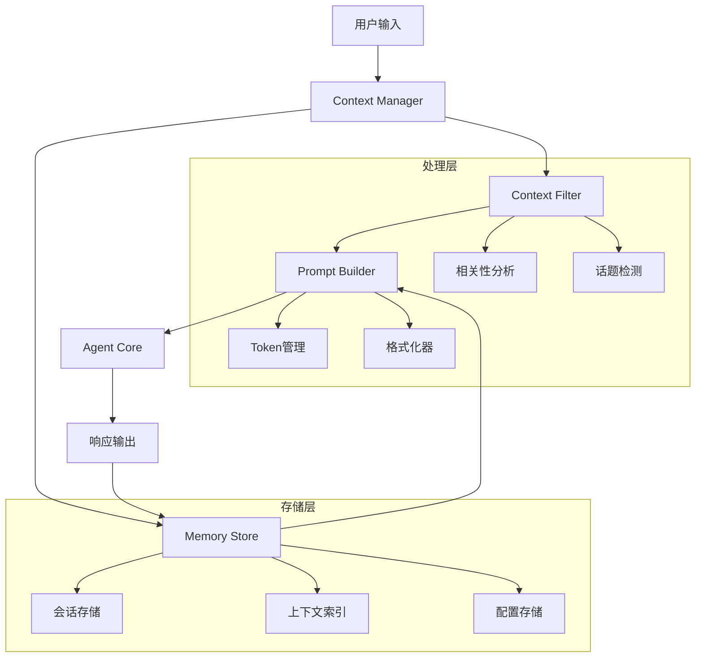

# 设计文档

## 概述

Agent上下文记忆系统是一个智能的对话管理解决方案，旨在为用户提供连续、上下文感知的对话体验。系统通过智能的上下文选择、高效的存储管理和清晰的prompt构建，解决了当前agent对话中缺乏记忆的问题。

## 架构

系统采用分层架构设计，包含以下核心组件：



## 组件和接口

### Context Manager (上下文管理器)

**职责：** 协调整个上下文记忆系统的运作

**接口：**
```python
class ContextManager:
    def process_user_input(self, user_input: str, session_id: str) -> str
    def get_session_context(self, session_id: str) -> SessionContext
    def update_context(self, session_id: str, interaction: Interaction) -> None
    def configure_strategy(self, config: ContextConfig) -> None
```

### Memory Store (记忆存储)

**职责：** 高效存储和检索对话历史及相关上下文

**接口：**
```python
class MemoryStore:
    def save_interaction(self, session_id: str, interaction: Interaction) -> None
    def get_session_history(self, session_id: str, limit: int = None) -> List[Interaction]
    def search_relevant_context(self, query: str, session_id: str) -> List[ContextItem]
    def cleanup_expired_data(self, retention_days: int) -> None
    def get_storage_stats(self) -> StorageStats
```

### Context Filter (上下文过滤器)

**职责：** 智能选择与当前问题最相关的历史上下文

**接口：**
```python
class ContextFilter:
    def select_relevant_context(self, current_input: str, history: List[Interaction]) -> List[ContextItem]
    def calculate_relevance_score(self, context: ContextItem, query: str) -> float
    def detect_topic_change(self, current_input: str, recent_context: List[ContextItem]) -> bool
    def apply_filtering_strategy(self, strategy: FilterStrategy) -> None
```

### Prompt Builder (提示构建器)

**职责：** 构建包含上下文的完整、结构化提示

**接口：**
```python
class PromptBuilder:
    def build_contextual_prompt(self, user_input: str, context: List[ContextItem]) -> str
    def format_context_section(self, context: List[ContextItem]) -> str
    def ensure_token_limits(self, prompt: str, max_tokens: int) -> str
    def add_section_markers(self, content: str, section_type: SectionType) -> str
```

## 数据模型

### 核心数据结构

```python
@dataclass
class Interaction:
    id: str
    session_id: str
    timestamp: datetime
    user_input: str
    agent_response: str
    context_used: List[str]
    metadata: Dict[str, Any]

@dataclass
class ContextItem:
    id: str
    content: str
    type: ContextType  # USER_INPUT, AGENT_RESPONSE, CODE_SNIPPET, ERROR_INFO
    timestamp: datetime
    relevance_score: float
    source_interaction_id: str

@dataclass
class SessionContext:
    session_id: str
    created_at: datetime
    last_updated: datetime
    interaction_count: int
    current_topic: Optional[str]
    active_files: List[str]
    configuration: ContextConfig

@dataclass
class ContextConfig:
    max_context_length: int = 4000
    relevance_threshold: float = 0.3
    max_history_items: int = 20
    enable_topic_detection: bool = True
    context_retention_days: int = 30
```

### 存储模式

```python
# 会话表
sessions = {
    "session_id": str,
    "created_at": datetime,
    "last_updated": datetime,
    "metadata": dict
}

# 交互表
interactions = {
    "id": str,
    "session_id": str,
    "timestamp": datetime,
    "user_input": str,
    "agent_response": str,
    "context_used": list,
    "metadata": dict
}

# 上下文索引表
context_index = {
    "id": str,
    "session_id": str,
    "content_hash": str,
    "content_type": str,
    "keywords": list,
    "embedding_vector": list,  # 用于语义搜索
    "interaction_id": str
}
```

## 错误处理

### 错误类型和处理策略

1. **存储错误**
   - 数据库连接失败：降级到内存存储
   - 存储空间不足：自动清理过期数据
   - 数据损坏：使用备份恢复

2. **上下文处理错误**
   - Token限制超出：智能截断上下文
   - 相关性计算失败：使用时间顺序回退
   - 格式化错误：使用简化格式

3. **性能问题**
   - 检索超时：使用缓存结果
   - 内存不足：减少上下文长度
   - 并发冲突：实现乐观锁机制

### 错误恢复机制

```python
class ErrorRecoveryManager:
    def handle_storage_error(self, error: StorageError) -> RecoveryAction
    def handle_context_error(self, error: ContextError) -> RecoveryAction
    def handle_performance_issue(self, issue: PerformanceIssue) -> RecoveryAction
    def log_error_metrics(self, error: Exception) -> None
```

## 正确性属性

*属性是一个特征或行为，应该在系统的所有有效执行中保持为真——本质上是关于系统应该做什么的正式陈述。属性作为人类可读规范和机器可验证正确性保证之间的桥梁。*

### 属性 1: 会话隔离和状态维护
*对于任何* 会话和消息序列，每个会话应该维护独立的上下文空间，并且在会话内的每次新消息都能访问到完整的历史记录
**验证：需求 1.1, 1.4**

### 属性 2: 智能上下文选择
*对于任何* 当前问题和历史上下文集合，系统选择的上下文应该是与当前问题最相关的，并且在内容过多时优先保留最相关的信息
**验证：需求 2.1, 2.2**

### 属性 3: 话题感知策略调整
*对于任何* 包含话题转换的对话序列，当检测到话题变化时，上下文选择策略应该相应调整
**验证：需求 2.3**

### 属性 4: Token限制遵守
*对于任何* 上下文拼接操作，最终生成的提示应该不超过指定的token限制
**验证：需求 2.4**

### 属性 5: 结构化提示构建
*对于任何* 提示构建请求，输出应该包含明确的区分标记、时间戳标注、类型标识和清晰的层次结构
**验证：需求 3.1, 3.2, 3.3, 3.4**

### 属性 6: 语义引用能力
*对于任何* 包含对历史内容引用的用户输入，系统应该能够正确识别并提供相关的历史信息
**验证：需求 1.2, 5.3**

### 属性 7: 长度限制下的智能保留
*对于任何* 超过长度限制的对话历史，系统保留的上下文应该是最相关的子集
**验证：需求 1.3**

### 属性 8: 高负载降级处理
*对于任何* 高负载情况，系统应该能够进行降级处理以保证响应速度
**验证：需求 4.2**

### 属性 9: 配置参数生效
*对于任何* 管理员配置的参数变更，系统行为应该相应调整并生效
**验证：需求 4.3**

### 属性 10: 数据清理机制
*对于任何* 过期数据，系统应该提供有效的自动和手动清理机制
**验证：需求 4.4**

### 属性 11: 场景感知上下文管理
*对于任何* 特定场景（代码讨论、问题诊断、多文件操作），系统应该保留和维护相关的上下文信息和关联关系
**验证：需求 5.1, 5.2, 5.4**

### 属性 12: 监控和统计功能
*对于任何* 系统运行状态，应该能够提供准确的统计信息和性能指标
**验证：需求 6.2, 6.4**

### 属性 13: 错误处理和信息提供
*对于任何* 上下文相关错误，系统应该提供详细的错误信息和建议
**验证：需求 6.3**

## 测试策略

### 双重测试方法

本系统将采用单元测试和基于属性的测试相结合的方法：

**单元测试：**
- 验证特定示例和边界情况
- 测试组件间的集成点
- 验证错误条件和异常处理
- 测试调试模式等特定功能

**基于属性的测试：**
- 验证跨所有输入的通用属性
- 通过随机化实现全面的输入覆盖
- 每个属性测试最少运行100次迭代
- 使用Python的Hypothesis库进行属性测试

**属性测试配置：**
- 最少100次迭代每个属性测试
- 每个属性测试必须引用其设计文档属性
- 标签格式：**功能：agent-context-memory，属性 {编号}：{属性文本}**

**测试重点：**
- 单元测试关注具体示例和边界情况
- 属性测试验证系统在各种输入下的正确性
- 两种测试方法互补，确保全面覆盖

### 测试库选择

- **单元测试框架：** pytest
- **属性测试库：** Hypothesis
- **模拟框架：** unittest.mock
- **性能测试：** pytest-benchmark