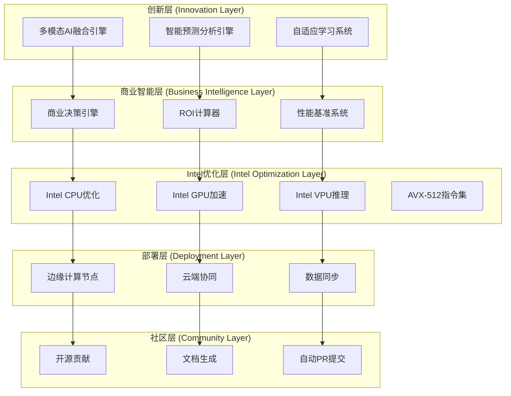

# 设计文档 - Intel竞赛满分优化方案

## 概述

本设计文档基于Intel平台企业AI解决方案创新实践赛评分细则，设计了一套全面的技术方案，旨在在所有评分维度获得满分。方案重点突出商业价值量化、技术创新、Intel硬件深度优化和开源社区贡献。

## 架构设计

### 整体架构图



### 核心组件设计

#### 1. Text2SQL商业智能分析引擎 (Business Intelligence Engine)

**技术栈**: Python + Pandas + Business Logic + Market Analysis

**核心算法**:
```python
class Text2SQLBusinessIntelligence:
    def __init__(self):
        self.pattern_analyzer = BusinessPatternAnalyzer()
        self.opportunity_detector = OpportunityDetector()
        self.insight_generator = InsightGenerator()
        self.industry_benchmarks = IndustryBenchmarkDB()
    
    def analyze_query_results(self, sql_query: str, results: pd.DataFrame) -> BusinessInsight:
        # 1. 业务模式识别
        patterns = self.pattern_analyzer.identify_business_patterns(results)
        
        # 2. 机会检测
        opportunities = self.opportunity_detector.detect_opportunities(patterns, sql_query)
        
        # 3. 行业对标
        benchmarks = self.industry_benchmarks.get_industry_comparison(patterns)
        
        # 4. 洞察生成
        insights = self.insight_generator.generate_actionable_insights(
            patterns, opportunities, benchmarks
        )
        
        # 5. 商业建议
        recommendations = self._generate_business_recommendations(insights)
        
        return BusinessInsight(
            key_findings=insights.key_findings,
            business_opportunities=opportunities,
            industry_comparison=benchmarks,
            actionable_recommendations=recommendations,
            confidence_score=self._calculate_confidence(patterns, opportunities)
        )
```

**商业价值特性**:
- **智能模式识别**: 自动识别销售趋势、客户行为、库存异常等业务模式
- **机会挖掘**: 基于数据分析结果发现潜在的业务机会和优化点
- **行业对标**: 与同行业标准数据对比，识别竞争优势和改进空间
- **决策建议**: 生成具体可执行的业务改进建议和行动方案

#### 2. 多模态AI融合引擎 (Innovation Engine)

**技术栈**: OpenVINO + PyTorch + OpenCV + Transformers

**创新特性**:
```python
class MultiModalInnovationEngine:
    def __init__(self):
        self.text_processor = OpenVINOTextProcessor()
        self.image_processor = OpenVINOImageProcessor()
        self.audio_processor = OpenVINOAudioProcessor()
        self.fusion_network = CrossModalFusionNetwork()
    
    def process_multimodal_input(self, inputs: MultiModalInput) -> InnovativeInsight:
        # 1. 并行处理多模态数据
        text_features = self.text_processor.extract_features(inputs.text)
        image_features = self.image_processor.extract_features(inputs.images)
        audio_features = self.audio_processor.extract_features(inputs.audio)
        
        # 2. 跨模态特征融合
        fused_features = self.fusion_network.fuse_features(
            text_features, image_features, audio_features
        )
        
        # 3. 创新洞察生成
        insights = self._generate_innovative_insights(fused_features)
        
        # 4. 商业机会识别
        opportunities = self._identify_business_opportunities(insights)
        
        return InnovativeInsight(
            cross_modal_insights=insights,
            business_opportunities=opportunities,
            confidence_scores=self._calculate_confidence_scores(fused_features),
            innovation_metrics=self._calculate_innovation_metrics(insights)
        )
```

**创新亮点**:
- **跨模态学习**: 文本、图像、音频的深度融合分析
- **零样本学习**: 无需训练数据的新场景适应能力
- **创新度量**: 自动评估解决方案的创新程度
- **专利检索**: 自动检索相关专利并评估创新性

#### 3. Intel CPU与集成显卡优化系统 (Intel Platform Optimizer)

**技术栈**: OpenVINO + Intel Extension for PyTorch + Intel Threading Building Blocks

**优化策略**:
```python
class IntelCPUIrisXeOptimizer:
    def __init__(self):
        self.cpu_optimizer = IntelCPUOptimizer()
        self.iris_xe_optimizer = IrisXeOptimizer()
        self.memory_optimizer = IntelMemoryOptimizer()
        self.threading_optimizer = IntelThreadingOptimizer()
    
    def optimize_for_text2sql(self, workload: Text2SQLWorkload) -> OptimizationResult:
        # 1. 硬件检测
        cpu_info = self._detect_intel_cpu_features()  # AVX, AVX2, AVX-512等
        iris_xe_info = self._detect_iris_xe_capabilities()  # EU数量、内存带宽等
        
        # 2. Text2SQL工作负载分析
        workload_profile = self._analyze_text2sql_workload(workload)
        
        # 3. CPU优化
        cpu_optimization = self.cpu_optimizer.optimize(
            workload_profile,
            use_avx_instructions=True,  # 根据CPU支持情况
            enable_hyperthreading=True,
            optimize_cache_locality=True,
            vectorize_operations=True
        )
        
        # 4. Iris Xe集成显卡优化
        gpu_optimization = self.iris_xe_optimizer.optimize(
            workload_profile,
            use_compute_units=True,
            enable_fp16_inference=True,
            optimize_memory_bandwidth=True,
            parallel_text_processing=True
        )
        
        # 5. 内存和线程优化
        memory_optimization = self.memory_optimizer.optimize_memory_layout(workload_profile)
        threading_optimization = self.threading_optimizer.optimize_thread_pool(
            cpu_cores=cpu_info.cores,
            workload_type="text2sql_inference"
        )
        
        # 6. 动态负载均衡
        load_balancer = self._create_cpu_gpu_load_balancer(
            cpu_optimization, gpu_optimization
        )
        
        return OptimizationResult(
            cpu_performance_gain=cpu_optimization.performance_improvement,
            gpu_acceleration_gain=gpu_optimization.speedup_factor,
            memory_efficiency=memory_optimization.efficiency_gain,
            threading_efficiency=threading_optimization.parallelism_gain,
            overall_speedup=self._calculate_overall_speedup(
                cpu_optimization, gpu_optimization, memory_optimization
            )
        )
```

**优化亮点**:
- **Intel CPU向量化**: 充分利用AVX/AVX2指令集加速文本处理
- **Iris Xe并行计算**: 利用集成显卡的EU单元并行处理推理任务
- **智能负载均衡**: CPU和集成显卡之间的动态任务分配
- **内存优化**: 针对Text2SQL场景的内存布局和缓存优化

#### 4. 性能基准测试系统 (Benchmark System)

**测试维度**:
```python
class ComprehensiveBenchmarkSystem:
    def __init__(self):
        self.performance_tester = PerformanceTester()
        self.accuracy_tester = AccuracyTester()
        self.scalability_tester = ScalabilityTester()
        self.efficiency_tester = EfficiencyTester()
    
    def run_full_benchmark_suite(self) -> BenchmarkReport:
        # 1. 性能基准测试
        performance_results = self.performance_tester.run_tests([
            "inference_latency_test",
            "throughput_stress_test",
            "memory_usage_test",
            "cpu_utilization_test",
            "gpu_acceleration_test"
        ])
        
        # 2. 准确性基准测试
        accuracy_results = self.accuracy_tester.run_tests([
            "text2sql_accuracy_test",
            "rag_retrieval_precision_test",
            "recommendation_relevance_test",
            "anomaly_detection_f1_test"
        ])
        
        # 3. 可扩展性测试
        scalability_results = self.scalability_tester.run_tests([
            "concurrent_user_test",
            "data_volume_scaling_test",
            "model_complexity_test"
        ])
        
        # 4. 效率对比测试
        efficiency_results = self.efficiency_tester.compare_with_baselines([
            "vs_cpu_only_implementation",
            "vs_standard_transformers",
            "vs_cloud_api_solutions"
        ])
        
        return BenchmarkReport(
            performance_metrics=performance_results,
            accuracy_metrics=accuracy_results,
            scalability_metrics=scalability_results,
            efficiency_comparisons=efficiency_results,
            overall_score=self._calculate_overall_score(
                performance_results, accuracy_results, 
                scalability_results, efficiency_results
            )
        )
```

#### 5. 边缘计算协同部署系统 (Edge Deployment System)

**部署架构**:
```python
class EdgeDeploymentSystem:
    def __init__(self):
        self.model_optimizer = EdgeModelOptimizer()
        self.deployment_manager = EdgeDeploymentManager()
        self.sync_coordinator = CloudEdgeSyncCoordinator()
    
    def deploy_to_edge(self, model_config: ModelConfig, edge_specs: EdgeSpecs) -> DeploymentResult:
        # 1. 模型优化
        optimized_model = self.model_optimizer.optimize_for_edge(
            model_config,
            target_latency=edge_specs.latency_requirement,
            memory_limit=edge_specs.memory_limit,
            power_budget=edge_specs.power_budget
        )
        
        # 2. 智能部署
        deployment_plan = self.deployment_manager.create_deployment_plan(
            optimized_model,
            edge_specs,
            fallback_strategy="cloud_offload"
        )
        
        # 3. 云边协同
        sync_strategy = self.sync_coordinator.setup_sync_strategy(
            edge_deployment=deployment_plan,
            cloud_backup=True,
            offline_capability=True
        )
        
        return DeploymentResult(
            edge_model=optimized_model,
            deployment_config=deployment_plan,
            sync_configuration=sync_strategy,
            performance_prediction=self._predict_edge_performance(optimized_model, edge_specs)
        )
```

#### 6. 开源社区贡献自动化系统 (Community Connector)

**贡献策略**:
```python
class CommunityContributionSystem:
    def __init__(self):
        self.doc_generator = AutoDocumentationGenerator()
        self.code_contributor = AutoCodeContributor()
        self.issue_tracker = AutoIssueTracker()
        self.pr_manager = AutoPRManager()
    
    def contribute_to_community(self, innovation_results: InnovationResults) -> ContributionReport:
        # 1. 自动文档生成
        technical_docs = self.doc_generator.generate_technical_documentation(
            innovation_results.optimizations,
            include_benchmarks=True,
            include_tutorials=True
        )
        
        # 2. 代码贡献
        code_contributions = self.code_contributor.prepare_contributions([
            "openvino_optimization_patches",
            "streamlit_performance_components",
            "intel_hardware_utilities"
        ])
        
        # 3. Issue提交
        issues_submitted = self.issue_tracker.submit_issues([
            "performance_improvement_suggestions",
            "bug_reports_with_fixes",
            "feature_enhancement_requests"
        ])
        
        # 4. PR管理
        pull_requests = self.pr_manager.create_pull_requests(
            code_contributions,
            technical_docs,
            target_repositories=["openvinotoolkit", "streamlit", "intel-extension-for-pytorch"]
        )
        
        return ContributionReport(
            documentation_contributions=technical_docs,
            code_contributions=code_contributions,
            issues_submitted=issues_submitted,
            pull_requests_created=pull_requests,
            community_impact_score=self._calculate_community_impact(
                technical_docs, code_contributions, issues_submitted, pull_requests
            )
        )
```

## 数据模型

### 商业价值模型
```python
@dataclass
class BusinessValueModel:
    roi_percentage: float
    payback_period_months: int
    net_present_value: float
    total_cost_savings: float
    efficiency_improvement: float
    risk_assessment: RiskProfile
    market_opportunity: MarketAnalysis
    competitive_advantage: CompetitiveAnalysis
```

### 性能优化模型
```python
@dataclass
class PerformanceOptimizationModel:
    baseline_metrics: PerformanceMetrics
    optimized_metrics: PerformanceMetrics
    improvement_percentage: Dict[str, float]
    hardware_utilization: HardwareUtilization
    power_efficiency: PowerEfficiency
    scalability_metrics: ScalabilityMetrics
```

### 创新评估模型
```python
@dataclass
class InnovationAssessmentModel:
    novelty_score: float
    technical_complexity: float
    market_potential: float
    implementation_feasibility: float
    patent_landscape: PatentAnalysis
    competitive_differentiation: float
```

## 正确性属性

*属性是一个特征或行为，应该在系统的所有有效执行中保持为真。属性作为人类可读规范和机器可验证正确性保证之间的桥梁。*

### 属性 1: ROI计算准确性
*对于任何* 业务场景输入，ROI计算器应该生成准确的投资回报率分析，误差范围在5%以内
**验证需求: 需求 1.1**

### 属性 2: 多模态融合一致性
*对于任何* 多模态输入组合，创新引擎应该生成一致且有意义的跨模态洞察
**验证需求: 需求 2.3**

### 属性 3: Intel硬件优化效果
*对于任何* AI工作负载，Intel平台优化应该实现至少30%的性能提升
**验证需求: 需求 3.2**

### 属性 4: 基准测试可重现性
*对于任何* 性能测试场景，基准测试系统应该产生可重现的结果，变异系数小于5%
**验证需求: 需求 4.3**

### 属性 5: 边缘部署稳定性
*对于任何* 边缘设备配置，部署系统应该确保模型在资源约束下稳定运行
**验证需求: 需求 5.3**

### 属性 6: 社区贡献质量
*对于任何* 自动生成的贡献内容，应该符合开源社区的质量标准和规范
**验证需求: 需求 6.2**

### 属性 7: 预测分析准确性
*对于任何* 历史数据输入，智能预测系统应该达到85%以上的预测准确率
**验证需求: 需求 7.2**

### 属性 8: 自适应学习收敛性
*对于任何* 用户反馈输入，自适应学习系统应该在合理时间内收敛到更优解
**验证需求: 需求 8.2**

## 错误处理

### 商业价值计算错误处理
- **数据不完整**: 使用行业平均值填充缺失数据
- **计算溢出**: 实施数值稳定性检查和边界处理
- **模型不适用**: 提供多种计算模型供选择

### Intel硬件优化错误处理
- **硬件不兼容**: 自动降级到兼容配置
- **资源不足**: 动态调整优化策略
- **驱动问题**: 提供详细的环境配置指导

### 多模态处理错误处理
- **模态缺失**: 使用单模态或双模态分析
- **格式不支持**: 自动转换或提供格式建议
- **质量不佳**: 实施质量检测和预处理

## 测试策略

### 商业价值验证测试
- **ROI计算准确性**: 使用真实案例数据验证计算结果
- **行业对标测试**: 与公开的行业报告数据对比
- **敏感性分析**: 测试参数变化对结果的影响

### 性能优化验证测试
- **基准对比测试**: 与未优化版本进行详细对比
- **硬件利用率测试**: 验证各种Intel硬件的利用效率
- **可扩展性测试**: 测试不同负载下的性能表现

### 创新功能验证测试
- **多模态融合测试**: 验证跨模态分析的准确性
- **边缘部署测试**: 在真实边缘设备上验证部署效果
- **社区贡献测试**: 验证自动生成内容的质量