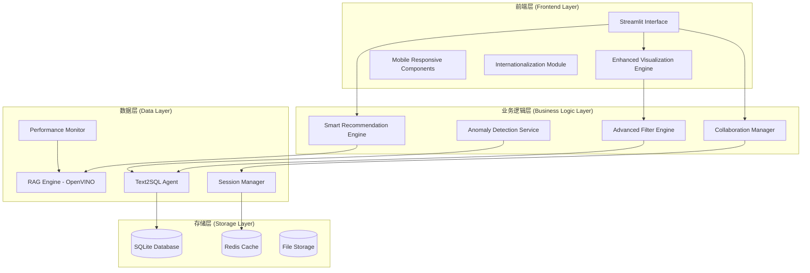

# 设计文档 - Intel DeepInsight 用户体验优化

## 概述

本设计文档详细规划了 Intel® DeepInsight 智能零售决策系统的用户体验优化方案。基于当前的 Streamlit + OpenVINO + DeepSeek 架构，我们将通过模块化设计实现8个核心UX改进领域，显著提升系统的易用性、可视化效果和用户满意度。

## 架构设计

### 整体架构图



### 核心组件设计

#### 1. 增强可视化引擎 (Enhanced Visualization Engine)

**技术栈**: Plotly + Streamlit + Custom Components

**组件结构**:
```python
class VisualizationEngine:
    def __init__(self):
        self.chart_factory = ChartFactory()
        self.interaction_handler = InteractionHandler()
        self.theme_manager = ThemeManager()
    
    def auto_visualize(self, df: pd.DataFrame, query_context: str) -> Dict:
        chart_type = self._detect_optimal_chart_type(df, query_context)
        return self.chart_factory.create_chart(df, chart_type)
    
    def _detect_optimal_chart_type(self, df: pd.DataFrame, context: str) -> str:
        # 智能图表类型检测逻辑
        pass
```

**支持的图表类型**:
- 时间序列: 折线图、面积图、蜡烛图
- 分类数据: 柱状图、水平条形图、饼图、环形图、树状图
- 地理数据: 散点地图、热力图、区域填充图
- 关系数据: 散点图、气泡图、相关性矩阵
- 分布数据: 直方图、箱线图、小提琴图

#### 2. 智能推荐引擎 (Smart Recommendation Engine)

**算法设计**:
```python
class RecommendationEngine:
    def __init__(self, rag_engine, embedding_model):
        self.rag = rag_engine
        self.embedding_model = embedding_model
        self.question_templates = self._load_templates()
        self.user_history = UserHistoryManager()
    
    def generate_recommendations(self, current_query: str, result_df: pd.DataFrame) -> List[str]:
        # 1. 基于查询结果的语义推荐
        semantic_recs = self._semantic_recommendations(current_query, result_df)
        
        # 2. 基于数据特征的模板推荐  
        template_recs = self._template_recommendations(result_df)
        
        # 3. 基于用户历史的个性化推荐
        personal_recs = self._personalized_recommendations(current_query)
        
        return self._rank_and_filter(semantic_recs + template_recs + personal_recs)
```

**推荐策略**:
- **语义相似性**: 使用 OpenVINO 加速的嵌入模型计算问题相似度
- **数据驱动**: 基于查询结果的数据特征生成后续问题
- **模板匹配**: 预定义的业务问题模板库
- **个性化**: 基于用户历史行为的协同过滤

#### 3. 协作分享系统 (Collaboration System)

**会话管理设计**:
```python
class CollaborationManager:
    def __init__(self):
        self.session_store = SessionStore()
        self.report_generator = ReportGenerator()
        self.sharing_service = SharingService()
    
    def create_shareable_session(self, session_id: str) -> str:
        session_data = self.session_store.get_full_session(session_id)
        share_token = self.sharing_service.create_share_token(session_data)
        return f"/shared/{share_token}"
    
    def generate_report(self, session_id: str, format: str = "pdf") -> bytes:
        return self.report_generator.create_report(session_id, format)
```

**功能特性**:
- **会话快照**: 完整保存查询历史、图表配置、用户注释
- **链接分享**: 生成唯一分享链接，支持权限控制
- **报告导出**: PDF/Excel/PowerPoint 格式导出
- **实时协作**: WebSocket 支持多用户同时查看和注释

#### 4. 移动端适配框架 (Mobile Responsive Framework)

**响应式设计策略**:
```css
/* 核心响应式断点 */
@media (max-width: 768px) {
    .sidebar { transform: translateX(-100%); }
    .main-content { margin-left: 0; }
    .chart-container { height: 300px; }
}

@media (max-width: 480px) {
    .metric-cards { flex-direction: column; }
    .button-group { flex-wrap: wrap; }
}
```

**移动端优化组件**:
- **触摸友好**: 增大按钮尺寸，优化触摸目标
- **手势支持**: 图表缩放、滑动切换
- **语音输入**: 集成 Web Speech API
- **离线缓存**: Service Worker 支持离线查看

#### 5. 性能监控可视化 (Performance Monitoring Visualization)

**监控指标设计**:
```python
class PerformanceMonitor:
    def __init__(self):
        self.metrics_collector = MetricsCollector()
        self.alert_manager = AlertManager()
        self.dashboard = PerformanceDashboard()
    
    def collect_metrics(self) -> Dict:
        return {
            'openvino_latency': self._measure_openvino_latency(),
            'memory_usage': self._get_memory_usage(),
            'cpu_utilization': self._get_cpu_usage(),
            'rag_accuracy': self._calculate_rag_accuracy(),
            'query_success_rate': self._get_success_rate()
        }
```

**可视化组件**:
- **实时仪表盘**: 关键指标的实时显示
- **历史趋势**: 24小时性能趋势图
- **异常告警**: 自动检测性能异常并提醒
- **优化建议**: 基于性能数据的智能优化建议

## 数据模型

### 用户会话模型
```python
@dataclass
class UserSession:
    session_id: str
    user_id: Optional[str]
    created_at: datetime
    last_active: datetime
    messages: List[Message]
    preferences: UserPreferences
    shared_tokens: List[str]
    annotations: List[Annotation]
```

### 推荐系统模型
```python
@dataclass
class RecommendationContext:
    current_query: str
    result_summary: Dict
    user_history: List[str]
    data_schema: Dict
    business_domain: str
```

### 性能指标模型
```python
@dataclass
class PerformanceMetrics:
    timestamp: datetime
    openvino_latency_ms: float
    memory_usage_mb: float
    cpu_percent: float
    rag_retrieval_time_ms: float
    sql_execution_time_ms: float
    user_satisfaction_score: Optional[float]
```

## 错误处理

### 错误分类与处理策略

1. **网络错误**: 自动重试 + 离线模式降级
2. **API限流**: 智能退避 + 本地缓存
3. **数据解析错误**: 容错处理 + 用户友好提示
4. **可视化渲染错误**: 降级到简单图表 + 错误报告
5. **移动端兼容性**: 特性检测 + 渐进增强

### 用户反馈机制
```python
class ErrorHandler:
    def handle_visualization_error(self, error: Exception, data: pd.DataFrame):
        # 1. 记录错误详情
        self.logger.error(f"Visualization failed: {error}")
        
        # 2. 降级到简单表格
        fallback_display = self.create_fallback_table(data)
        
        # 3. 用户友好提示
        user_message = "图表渲染遇到问题，已切换到表格显示。"
        
        return fallback_display, user_message
```

## 测试策略

### 单元测试覆盖
- **可视化引擎**: 图表类型检测、数据转换、渲染逻辑
- **推荐系统**: 算法准确性、性能基准、边界条件
- **协作功能**: 会话管理、分享权限、数据一致性
- **移动端适配**: 响应式布局、触摸事件、兼容性

### 集成测试场景
- **端到端用户流程**: 从查询到可视化到分享的完整流程
- **多设备兼容性**: 桌面、平板、手机的跨设备测试
- **性能压力测试**: 大数据量、高并发用户的性能表现
- **国际化测试**: 多语言界面、本地化内容的正确性

## 正确性属性

*属性是一个特征或行为，应该在系统的所有有效执行中保持为真。属性作为人类可读规范和机器可验证正确性保证之间的桥梁。*

基于需求分析，我们识别出以下关键的正确性属性，这些属性将通过基于属性的测试进行验证：

### 属性 1: 可视化类型智能检测
*对于任何* 包含时间序列数据的查询结果，可视化组件应该自动检测并生成时间序列类型的图表（折线图、面积图等）
**验证需求: 需求 1.1**

### 属性 2: 分类数据图表选项完整性
*对于任何* 包含分类数据的查询结果，可视化组件应该提供至少3种不同类型的图表选项（柱状图、饼图、环形图等）
**验证需求: 需求 1.2**

### 属性 3: 地理数据地图支持
*对于任何* 包含地理坐标或地名的数据，可视化组件应该支持生成地图类型的可视化
**验证需求: 需求 1.3**

### 属性 4: 图表交互性配置
*对于任何* 生成的图表，都应该包含悬停工具提示和交互配置，确保用户能够获取详细信息
**验证需求: 需求 1.4**

### 属性 5: 大数据量优化处理
*对于任何* 超过10个类别的数据集，可视化组件应该自动提供筛选、分页或缩放功能
**验证需求: 需求 1.5**

### 属性 6: 推荐问题数量一致性
*对于任何* 完成的查询，推荐系统应该生成3-5个相关的后续问题建议
**验证需求: 需求 2.1**

### 属性 7: 首页推荐内容相关性
*对于任何* 数据库内容，系统应该能够基于Schema和数据特征生成相关的示例问题
**验证需求: 需求 2.2**

### 属性 8: 自动补全响应性
*对于任何* 用户输入的关键词，系统应该在500ms内提供相关的问题建议列表
**验证需求: 需求 2.3**

### 属性 9: 用户偏好学习一致性
*对于任何* 用户的点击行为，系统应该正确记录偏好并在后续推荐中体现这些偏好
**验证需求: 需求 2.4**

### 属性 10: 数据更新响应性
*对于任何* 数据库内容的更新，推荐系统应该在下次查询时反映这些变化
**验证需求: 需求 2.5**

### 属性 11: 报告生成完整性
*对于任何* 完成的数据分析会话，系统应该能够生成包含查询、结果、图表和洞察的完整报告
**验证需求: 需求 3.1**

### 属性 12: 分享功能可用性
*对于任何* 分析会话，用户应该能够生成有效的分享链接或导出PDF报告
**验证需求: 需求 3.2**

### 属性 13: 会话数据完整性
*对于任何* 保存的用户会话，应该包含完整的查询历史、图表配置和用户注释
**验证需求: 需求 3.3**

### 属性 14: 注释关联正确性
*对于任何* 用户添加的注释，应该正确关联到对应的图表或结果元素
**验证需求: 需求 3.4**

### 属性 15: 分享会话还原一致性
*对于任何* 通过分享链接访问的会话，应该完整还原原始的分析场景和结果
**验证需求: 需求 3.5**

### 属性 16: 响应式布局适配
*对于任何* 屏幕尺寸，界面应该自动调整布局以确保内容的可读性和可用性
**验证需求: 需求 4.1**

### 属性 17: 移动端导航优化
*对于任何* 宽度小于768px的屏幕，侧边栏应该转换为可折叠的移动端导航菜单
**验证需求: 需求 4.2**

### 属性 18: 触摸交互支持
*对于任何* 触屏设备，界面应该正确响应触摸手势和滑动操作
**验证需求: 需求 4.3**

### 属性 19: 移动端图表优化
*对于任何* 在移动设备上显示的图表，应该优化触摸交互和缩放体验
**验证需求: 需求 4.4**

### 属性 20: 语音输入可用性
*对于任何* 支持语音输入的移动设备，系统应该提供语音输入选项
**验证需求: 需求 4.5**

### 属性 21: 性能指标实时性
*对于任何* 系统运行状态，性能监控应该实时显示OpenVINO延迟、内存使用和CPU占用
**验证需求: 需求 5.1**

### 属性 22: 异常检测告警
*对于任何* 超出正常范围的性能指标，系统应该显示警告提示和优化建议
**验证需求: 需求 5.2**

### 属性 23: 历史趋势可视化
*对于任何* 性能历史查询，系统应该提供过去24小时的完整趋势图
**验证需求: 需求 5.3**

### 属性 24: RAG性能透明度
*对于任何* RAG检索操作，系统应该显示检索精度和相关性评分
**验证需求: 需求 5.4**

### 属性 25: 负载优化响应
*对于任何* 高负载情况，系统应该提供性能优化模式切换选项
**验证需求: 需求 5.5**

### 属性 26: 界面语言一致性
*对于任何* 用户选择的语言，所有界面文本应该切换为对应的本地化版本
**验证需求: 需求 6.1**

### 属性 27: 多语言内容生成
*对于任何* 用户语言偏好，系统生成的洞察和分析结果应该使用对应的语言
**验证需求: 需求 6.2**

### 属性 28: 多语言查询理解
*对于任何* 非中文的用户查询，RAG引擎应该能够正确理解和处理
**验证需求: 需求 6.3**

### 属性 29: 报告语言一致性
*对于任何* 导出的报告，语言应该与当前界面语言保持一致
**验证需求: 需求 6.4**

### 属性 30: 错误信息本地化
*对于任何* 系统错误，应该显示用户选择语言的本地化错误信息和解决建议
**验证需求: 需求 6.5**

### 属性 31: 交互式筛选可用性
*对于任何* 查询结果显示，应该提供相应的交互式数据筛选器
**验证需求: 需求 7.1**

### 属性 32: 筛选实时响应
*对于任何* 用户筛选操作，图表和统计信息应该实时更新以反映筛选结果
**验证需求: 需求 7.2**

### 属性 33: 图表钻取功能
*对于任何* 可钻取的图表元素，点击应该能够展示更详细的数据
**验证需求: 需求 7.3**

### 属性 34: 时间范围交互
*对于任何* 时间序列图表，用户应该能够通过拖拽调整显示的时间范围
**验证需求: 需求 7.4**

### 属性 35: 筛选配置持久化
*对于任何* 用户创建的筛选配置，应该能够保存为可重用的快捷查询
**验证需求: 需求 7.5**

### 属性 36: 异常自动检测
*对于任何* 数据趋势分析，系统应该能够自动识别统计异常值和趋势变化
**验证需求: 需求 8.1**

### 属性 37: 异常可视化高亮
*对于任何* 检测到的异常，应该在相应的可视化中进行高亮显示
**验证需求: 需求 8.2**

### 属性 38: 异常影响分析
*对于任何* 影响关键指标的异常，系统应该生成包含可能原因的分析报告
**验证需求: 需求 8.3**

### 属性 39: 异常上下文信息
*对于任何* 异常详情查看，应该提供相关的历史对比和上下文信息
**验证需求: 需求 8.4**

### 属性 40: 持续异常处理
*对于任何* 持续存在的异常，系统应该提供业务影响评估和应对建议
**验证需求: 需求 8.5**