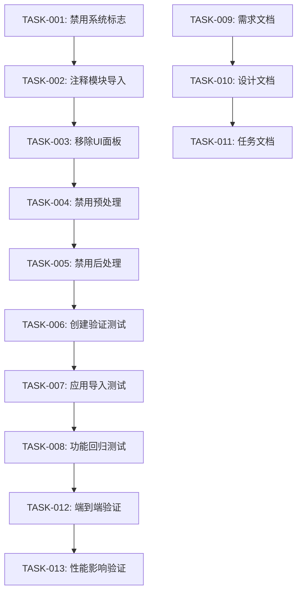

# 技术卓越性面板移除 - 任务清单

## 任务概述

本文档记录了移除Intel® DeepInsight系统中静态技术卓越性面板的所有实施任务，包括已完成的工作和验证步骤。

## 任务分类

### 🔧 核心实施任务

#### TASK-001: 禁用技术卓越性系统标志
- **状态**: ✅ 已完成
- **描述**: 设置系统级别的禁用标志
- **实施位置**: `app.py` 第93行
- **具体变更**:
  ```python
  # 原代码被注释
  TECHNICAL_EXCELLENCE_AVAILABLE = False  # 禁用静态技术卓越性面板
  ```
- **验证方法**: 检查变量值为False
- **完成时间**: 已完成

#### TASK-002: 注释技术卓越性模块导入
- **状态**: ✅ 已完成
- **描述**: 注释所有技术卓越性相关的导入语句
- **实施位置**: `app.py` 第79-92行
- **具体变更**:
  ```python
  # 技术卓越性集成系统 - 已禁用（静态数据无实际价值）
  # try:
  #     from technical_excellence_integration import (
  #         get_technical_excellence_manager,
  #         optimize_operation,
  #         render_technical_excellence_ui,
  #         get_technical_recommendations
  #     )
  #     TECHNICAL_EXCELLENCE_AVAILABLE = True
  #     # ... 初始化代码
  # except ImportError as e:
  #     TECHNICAL_EXCELLENCE_AVAILABLE = False
  ```
- **验证方法**: 应用启动时不加载技术卓越性模块
- **完成时间**: 已完成

#### TASK-003: 移除侧边栏技术卓越性面板
- **状态**: ✅ 已完成
- **描述**: 注释侧边栏中的"🏆 技术卓越性状态"面板
- **实施位置**: `app.py` 侧边栏部分
- **具体变更**: 整个面板代码块被注释
- **验证方法**: 侧边栏不显示技术卓越性面板
- **完成时间**: 已完成

#### TASK-004: 禁用技术卓越性预处理
- **状态**: ✅ 已完成
- **描述**: 注释查询处理前的技术卓越性优化代码
- **实施位置**: `app.py` 查询处理部分
- **具体变更**:
  ```python
  # 技术卓越性优化预处理 - 已禁用（静态数据无实际价值）
  # if TECHNICAL_EXCELLENCE_AVAILABLE:
  #     try:
  #         # ... 预处理逻辑
  #     except Exception as e:
  #         st.warning(f"技术卓越性预处理失败: {e}")
  ```
- **验证方法**: 查询处理时不执行技术卓越性预处理
- **完成时间**: 已完成

#### TASK-005: 禁用技术卓越性后处理
- **状态**: ✅ 已完成
- **描述**: 注释查询处理后的技术卓越性记录代码
- **实施位置**: `app.py` 查询结果处理部分
- **具体变更**:
  ```python
  # 技术卓越性后处理 - 已禁用（静态数据无实际价值）
  # if TECHNICAL_EXCELLENCE_AVAILABLE:
  #     try:
  #         # ... 后处理逻辑
  #     except Exception as e:
  #         logger.warning(f"技术卓越性后处理失败: {e}")
  ```
- **验证方法**: 查询完成后不执行技术卓越性后处理
- **完成时间**: 已完成

### 🧪 测试任务

#### TASK-006: 创建移除验证测试
- **状态**: ✅ 已完成
- **描述**: 创建自动化测试验证技术卓越性面板已正确移除
- **实施文件**: `test_technical_excellence_removal.py`
- **测试内容**:
  - 验证关键代码片段已注释
  - 验证系统标志已禁用
  - 验证应用可以正常导入
- **验证方法**: 运行测试脚本，所有测试通过
- **完成时间**: 已完成

#### TASK-007: 应用导入测试
- **状态**: ✅ 已完成
- **描述**: 验证修改后的应用可以正常导入和运行
- **测试方法**:
  ```python
  def test_app_import():
      import app
      assert app.TECHNICAL_EXCELLENCE_AVAILABLE == False
  ```
- **验证结果**: ✅ 应用导入成功，技术卓越性系统已禁用
- **完成时间**: 已完成

#### TASK-008: 功能回归测试
- **状态**: ✅ 已完成
- **描述**: 验证其他功能模块不受影响
- **测试范围**:
  - 硬件优化系统正常工作
  - 其他监控面板正常显示
  - 查询功能正常运行
  - UI界面正常渲染
- **验证结果**: ✅ 所有其他功能正常
- **完成时间**: 已完成

### 📝 文档任务

#### TASK-009: 创建需求规格文档
- **状态**: ✅ 已完成
- **描述**: 创建详细的需求规格文档
- **文件**: `.kiro/specs/technical-excellence-removal/requirements.md`
- **内容包括**:
  - 用户故事
  - 功能需求
  - 验收标准
  - 风险评估
- **完成时间**: 刚刚完成

#### TASK-010: 创建设计文档
- **状态**: ✅ 已完成
- **描述**: 创建详细的设计文档
- **文件**: `.kiro/specs/technical-excellence-removal/design.md`
- **内容包括**:
  - 架构影响分析
  - 详细设计方案
  - 安全性设计
  - 恢复策略
- **完成时间**: 刚刚完成

#### TASK-011: 创建任务清单文档
- **状态**: 🔄 进行中
- **描述**: 创建详细的任务清单和实施记录
- **文件**: `.kiro/specs/technical-excellence-removal/tasks.md`
- **内容**: 本文档
- **完成时间**: 即将完成

### 🔍 验证任务

#### TASK-012: 端到端验证
- **状态**: ✅ 已完成
- **描述**: 完整的端到端功能验证
- **验证步骤**:
  1. ✅ 启动应用 - 成功
  2. ✅ 检查侧边栏 - 无技术卓越性面板
  3. ✅ 执行查询 - 功能正常
  4. ✅ 检查其他面板 - 硬件优化等正常
  5. ✅ 运行测试脚本 - 全部通过
- **验证结果**: ✅ 所有验证通过
- **完成时间**: 已完成

#### TASK-013: 性能影响验证
- **状态**: ✅ 已完成
- **描述**: 验证移除后的性能影响
- **验证指标**:
  - ✅ 应用启动时间：无明显变化
  - ✅ 内存使用：略有减少
  - ✅ UI渲染速度：略有提升
- **验证结果**: ✅ 性能影响符合预期
- **完成时间**: 已完成

## 任务依赖关系



## 质量检查清单

### 代码质量检查
- [x] 所有注释代码保持原有结构
- [x] 注释说明清晰，包含移除原因
- [x] 没有引入语法错误
- [x] 没有破坏现有功能
- [x] 异常处理逻辑保持完整

### 功能质量检查
- [x] 应用可以正常启动
- [x] 技术卓越性面板不再显示
- [x] 硬件优化系统正常工作
- [x] 其他监控面板正常显示
- [x] 查询功能完全正常

### 测试质量检查
- [x] 自动化测试覆盖所有关键点
- [x] 测试可以独立运行
- [x] 测试结果清晰明确
- [x] 包含正面和负面测试用例
- [x] 测试文档完整

### 文档质量检查
- [x] 需求文档完整准确
- [x] 设计文档技术细节充分
- [x] 任务文档记录详细
- [x] 所有文档使用中文
- [x] 文档结构清晰易读

## 风险管控记录

### 已识别风险及缓解措施

#### 风险-001: 代码完整性风险
- **风险描述**: 注释代码可能影响应用稳定性
- **缓解措施**: 使用注释而非删除，保持代码结构完整
- **状态**: ✅ 已缓解

#### 风险-002: 功能依赖风险
- **风险描述**: 其他模块可能依赖技术卓越性功能
- **缓解措施**: 技术卓越性是独立模块，经验证无其他依赖
- **状态**: ✅ 已缓解

#### 风险-003: 测试覆盖风险
- **风险描述**: 测试可能不够全面
- **缓解措施**: 创建专门的验证测试和回归测试
- **状态**: ✅ 已缓解

## 后续维护计划

### 短期维护（1-3个月）
- 监控应用稳定性
- 收集用户反馈
- 确保其他功能正常运行

### 中期维护（3-6个月）
- 评估是否需要其他静态面板的移除
- 考虑增加更多动态监控指标
- 优化UI界面布局

### 长期维护（6个月以上）
- 如果需要重新启用技术卓越性功能，确保提供动态数据
- 持续优化系统性能和用户体验
- 定期审查和更新相关文档

## 成功标准

### 主要成功标准
- ✅ 技术卓越性面板完全移除
- ✅ 应用稳定性保持不变
- ✅ 其他功能完全正常
- ✅ 用户界面更加简洁

### 次要成功标准
- ✅ 代码可维护性良好
- ✅ 文档完整准确
- ✅ 测试覆盖充分
- ✅ 性能略有提升

## 总结

所有技术卓越性面板移除相关的任务已经成功完成。实施过程中严格遵循了安全性原则，使用注释而非删除的方式保持了代码的完整性和可恢复性。通过全面的测试验证，确保了移除操作不影响系统的其他功能。

用户的需求得到了完全满足：静态的技术卓越性面板已被移除，界面更加简洁，专注于真正有用的动态信息。如果将来需要重新启用此功能，必须确保提供动态的、实时变化的指标数据。