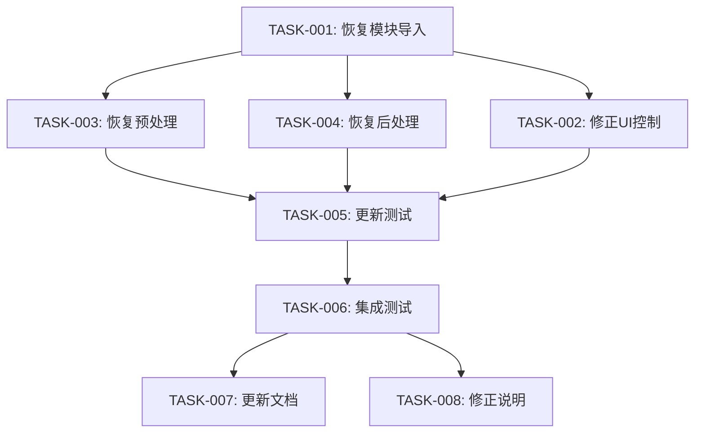

# 技术卓越性UI面板移除任务清单（仅前端）

## 任务概述

本文档记录了修正当前实施的任务清单，实现**只移除前端UI面板，但保留后端技术卓越性计算功能**的正确需求。

## 🔧 核心修正任务

### TASK-001: 恢复技术卓越性模块导入
- **状态**: 🔄 待执行
- **优先级**: 高
- **描述**: 恢复技术卓越性模块的导入和初始化
- **实施位置**: `app.py` 第79-99行
- **具体变更**:
  ```python
  # 当前（错误）
  # try:
  #     from technical_excellence_integration import (...)
  # TECHNICAL_EXCELLENCE_AVAILABLE = False
  
  # 修正后（正确）
  try:
      from technical_excellence_integration import (
          get_technical_excellence_manager,
          optimize_operation,
          render_technical_excellence_ui,
          get_technical_recommendations
      )
      TECHNICAL_EXCELLENCE_AVAILABLE = True
      tech_manager = get_technical_excellence_manager()
      tech_status = tech_manager.get_technical_status()
      print(f"✅ 技术卓越性后端系统已加载 - 评分: {tech_status.overall_score:.1f}% ({tech_status.maturity_level})")
  except ImportError as e:
      TECHNICAL_EXCELLENCE_AVAILABLE = False
      print(f"⚠️ 技术卓越性系统不可用: {e}")
  
  # 添加独立的UI控制
  TECHNICAL_EXCELLENCE_UI_ENABLED = False  # 前端UI面板禁用
  ```
- **验证方法**: 应用启动时加载技术卓越性模块，但不显示UI面板
- **需求引用**: FR-2

### TASK-002: 修正UI面板控制逻辑
- **状态**: 🔄 待执行
- **优先级**: 中
- **描述**: 修改UI面板代码，使用条件控制而非完全注释
- **实施位置**: `app.py` 侧边栏部分（约第733行）
- **具体变更**:
  ```python
  # 当前（完全注释）
  # 技术卓越性面板 - 已移除（静态数据无实际价值）
  # if TECHNICAL_EXCELLENCE_AVAILABLE:
  #     with st.expander("🏆 技术卓越性状态", expanded=False):
  #         # ... UI代码
  
  # 修正后（条件控制）
  # 技术卓越性面板 - 前端UI已禁用（用户要求界面简洁）
  if TECHNICAL_EXCELLENCE_AVAILABLE and TECHNICAL_EXCELLENCE_UI_ENABLED:
      with st.expander("🏆 技术卓越性状态", expanded=False):
          try:
              tech_status = tech_manager.get_technical_status()
              # ... 原有UI代码（保持注释状态）
          except Exception as e:
              st.error(f"技术卓越性面板错误: {e}")
  # UI面板被禁用，但后端功能继续工作
  ```
- **验证方法**: UI面板不显示，但可以通过配置重新启用
- **需求引用**: FR-1, FR-3

### TASK-003: 恢复技术卓越性预处理功能
- **状态**: 🔄 待执行
- **优先级**: 高
- **描述**: 恢复查询处理前的技术卓越性优化功能
- **实施位置**: `app.py` 查询处理部分（约第1744行）
- **具体变更**:
  ```python
  # 当前（完全禁用）
  # 技术卓越性优化预处理 - 已禁用（静态数据无实际价值）
  # if TECHNICAL_EXCELLENCE_AVAILABLE:
  #     try:
  #         # ... 预处理逻辑
  
  # 修正后（恢复功能）
  # 技术卓越性优化预处理 - 后端功能启用
  if TECHNICAL_EXCELLENCE_AVAILABLE:
      try:
          # 记录查询开始，用于性能监控
          query_start_time = time.perf_counter()
          
          # 估算输入大小
          input_size = len(prompt_input.encode('utf-8'))
          
          # 预测性能（如果有历史数据）
          tech_status = tech_manager.get_technical_status()
          if tech_status.overall_score >= 70:
              # 后端优化处理，不显示UI信息
              pass
          
      except Exception as e:
          logger.warning(f"技术卓越性预处理失败: {e}")
  ```
- **验证方法**: 查询处理时执行技术卓越性预处理，但不显示UI信息
- **需求引用**: FR-2

### TASK-004: 恢复技术卓越性后处理功能
- **状态**: 🔄 待执行
- **优先级**: 高
- **描述**: 恢复查询处理后的技术卓越性记录功能
- **实施位置**: `app.py` 查询结果处理部分（约第2442行）
- **具体变更**:
  ```python
  # 当前（完全禁用）
  # 技术卓越性后处理 - 已禁用（静态数据无实际价值）
  # if TECHNICAL_EXCELLENCE_AVAILABLE:
  #     try:
  #         # ... 后处理逻辑
  
  # 修正后（恢复功能）
  # 技术卓越性后处理 - 后端功能启用
  if TECHNICAL_EXCELLENCE_AVAILABLE:
      try:
          # 记录操作性能
          total_latency = (end_time - start_time) * 1000
          
          # 确定操作类型
          operation_type = "text2sql"
          if df_result is not None and len(df_result) > 0:
              operation_type = "sql_execution"
          elif curr_thought:
              operation_type = "reasoning"
          
          # 记录性能数据（后端处理）
          tech_manager.record_operation_performance(
              operation_type=operation_type,
              operation_id=f"query_{int(time.time())}",
              latency_ms=total_latency,
              error_occurred=False,
              cache_hit=False,
              input_size=len(prompt_input.encode('utf-8')),
              context={
                  'has_sql': sql_code is not None,
                  'has_data': df_result is not None,
                  'result_rows': len(df_result) if df_result is not None else 0,
                  'query_complexity': estimated_result_size if 'estimated_result_size' in locals() else 100
              }
          )
          
      except Exception as e:
          logger.warning(f"技术卓越性后处理失败: {e}")
  ```
- **验证方法**: 查询完成后执行技术卓越性后处理和性能记录
- **需求引用**: FR-2

## 🧪 测试任务

### TASK-005: 更新验证测试
- **状态**: 🔄 待执行
- **优先级**: 中
- **描述**: 更新测试文件以验证修正后的实施
- **实施文件**: `test_technical_excellence_ui_only_removal.py`
- **测试内容**:
  ```python
  def test_technical_excellence_backend_enabled():
      """测试技术卓越性后端功能已启用"""
      import app
      assert app.TECHNICAL_EXCELLENCE_AVAILABLE == True
      assert hasattr(app, 'tech_manager')
      print("✅ 技术卓越性后端功能已启用")

  def test_technical_excellence_ui_disabled():
      """测试技术卓越性UI面板已禁用"""
      import app
      assert app.TECHNICAL_EXCELLENCE_UI_ENABLED == False
      print("✅ 技术卓越性UI面板已禁用")

  def test_app_import_with_backend():
      """测试应用导入时后端功能正常"""
      try:
          import app
          # 验证后端功能可用
          if hasattr(app, 'tech_manager'):
              tech_status = app.tech_manager.get_technical_status()
              assert tech_status is not None
              print("✅ 技术卓越性后端功能正常工作")
          return True
      except Exception as e:
          print(f"❌ 后端功能测试失败: {e}")
          return False
  ```
- **验证方法**: 运行测试脚本，验证后端启用、UI禁用
- **需求引用**: 所有功能需求

### TASK-006: 功能集成测试
- **状态**: 🔄 待执行
- **优先级**: 中
- **描述**: 测试修正后的完整功能
- **测试范围**:
  - 应用正常启动
  - 技术卓越性模块正常加载
  - UI面板确实不显示
  - 预处理和后处理功能正常工作
  - 其他功能不受影响
- **验证方法**: 端到端功能测试
- **需求引用**: NFR-1, NFR-2

## 📝 文档任务

### TASK-007: 更新配置说明
- **状态**: 🔄 待执行
- **优先级**: 低
- **描述**: 更新相关文档说明新的配置方式
- **内容包括**:
  - 前端和后端功能的独立控制
  - 配置变量的说明
  - 如何重新启用UI面板（如果需要）
- **需求引用**: NFR-3

### TASK-008: 创建修正说明文档
- **状态**: 🔄 待执行
- **优先级**: 低
- **描述**: 记录修正过程和原因
- **内容包括**:
  - 原始需求的澄清
  - 修正前后的对比
  - 新的架构说明
- **需求引用**: 项目管理需要

## 任务依赖关系



## 实施检查清单

### 核心功能修正
- [ ] 恢复 `TECHNICAL_EXCELLENCE_AVAILABLE = True`
- [ ] 恢复技术卓越性模块导入
- [ ] 添加 `TECHNICAL_EXCELLENCE_UI_ENABLED = False`
- [ ] 恢复预处理功能代码
- [ ] 恢复后处理功能代码
- [ ] 修正UI面板控制逻辑

### 测试验证
- [ ] 创建新的测试文件
- [ ] 验证后端功能正常工作
- [ ] 验证UI面板确实隐藏
- [ ] 验证应用正常启动
- [ ] 验证其他功能不受影响

### 文档更新
- [ ] 更新配置说明
- [ ] 创建修正说明文档
- [ ] 更新相关注释

## 风险管控

### 已识别风险及缓解措施

#### 风险-001: 功能恢复可能引入错误
- **风险描述**: 恢复之前注释的代码可能引入问题
- **缓解措施**: 逐步恢复并测试每个功能模块
- **状态**: 🔄 待缓解

#### 风险-002: UI可能意外显示
- **风险描述**: 修改过程中UI面板可能意外显示
- **缓解措施**: 使用明确的条件控制，确保UI_ENABLED=False
- **状态**: 🔄 待缓解

#### 风险-003: 性能影响
- **风险描述**: 修改可能影响系统性能
- **缓解措施**: 保持原有的优化逻辑，只修改控制条件
- **状态**: 🔄 待缓解

## 成功标准

### 主要成功标准
- ✅ 前端UI面板保持隐藏（用户需求）
- 🔄 后端技术卓越性功能正常工作
- 🔄 系统性能优化效果保持不变
- 🔄 应用稳定性保持不变

### 次要成功标准
- 🔄 代码结构清晰易懂
- 🔄 配置灵活可控
- 🔄 测试覆盖充分
- 🔄 文档完整准确

## 验收标准

用户验收标准：
1. **前端简洁**: 界面不显示技术卓越性面板 ✅（已满足）
2. **后端功能**: 技术卓越性计算和优化功能正常工作 🔄（待修正）
3. **性能保持**: 系统性能优化效果不受影响 🔄（待验证）
4. **功能完整**: 其他所有功能正常运行 🔄（待验证）

## 总结

这个修正任务清单旨在纠正之前过度实施的问题，实现用户的真实需求：
- **保持**: 前端UI面板隐藏（界面简洁）
- **恢复**: 后端技术卓越性功能（性能优化）
- **改进**: 功能分离和配置控制（便于维护）

通过这些任务的执行，系统将既保持界面简洁，又享受技术卓越性带来的性能优化效果。