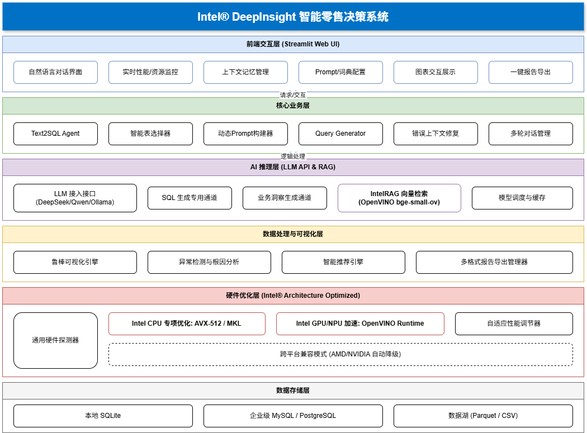
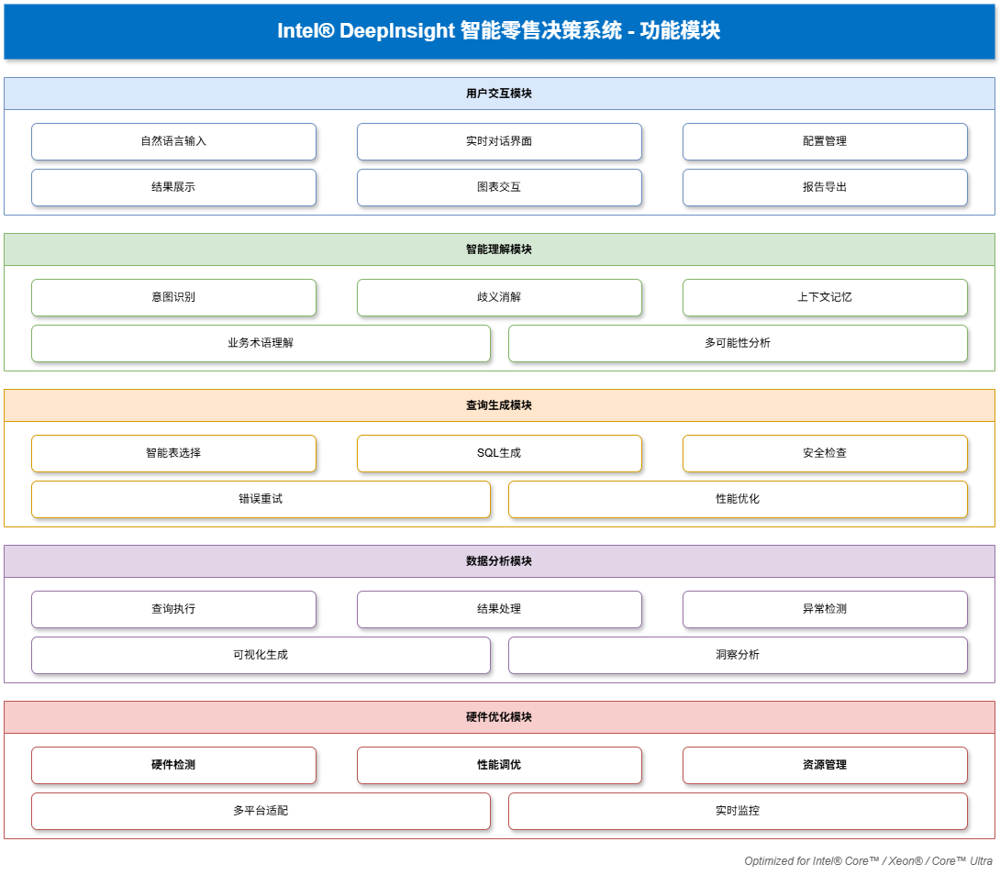
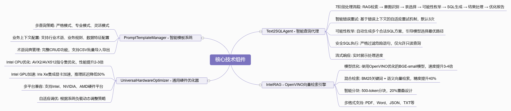
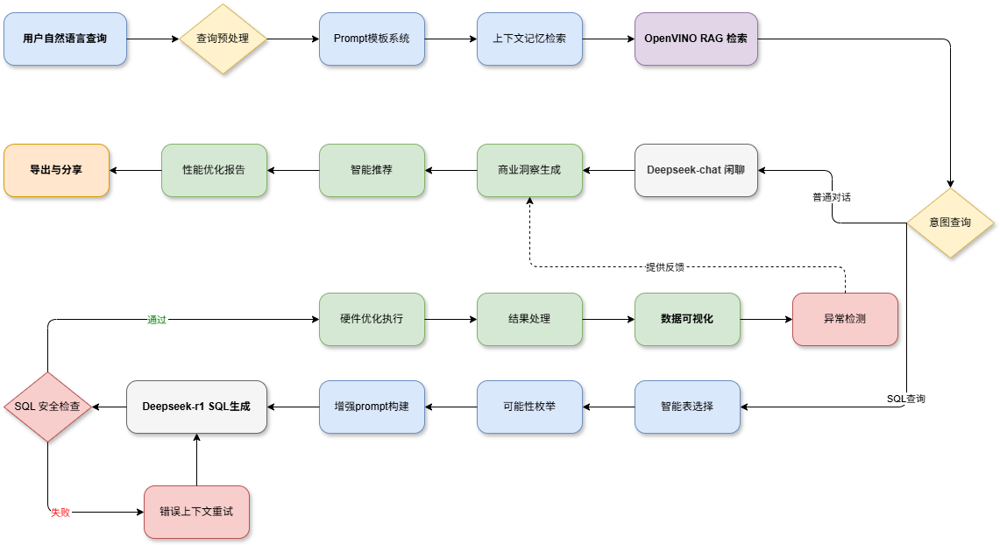

# 🚀 Intel® DeepInsight 智能零售决策系统

> **基于 Intel OpenVINO™ 与 DeepSeek R1 的全本地化、隐私优先的自然语言数据分析平台**  
> 适用于中小企业、分支机构及对数据合规有严苛要求的行业场景（如金融、制造、政务）

## 📋 项目简介

Intel® DeepInsight 是一个企业级智能数据分析平台，通过自然语言查询实现复杂的数据分析和可视化。系统采用前沿的 Text-to-SQL 技术，结合 RAG（检索增强生成）和智能硬件优化，为用户提供直观的数据洞察体验。

### ✨ 核心特性

- 🧠 **智能查询理解** - 支持自然语言查询，自动生成精确SQL
- 🚀 **全本地运行** - 基于 OpenVINO™ 本地推理，保护数据隐私
- 📊 **智能可视化** - 自动生成交互式图表和商业洞察
- ⚡ **硬件优化** - 支持 Intel/NVIDIA/AMD 多平台硬件加速
- 🔍 **异常检测** - 自动识别数据异常和业务风险点
- 📄 **完整导出** - 支持 PDF/Word 报告生成和会话分享
- 🧠 **上下文记忆** - 智能对话历史管理和上下文理解
- 📚 **业务配置** - 支持行业术语词典和业务上下文配置
- 📱 **全平台响应式** - 完美支持桌面、平板、手机多端访问
  - 🎯 自适应布局 (360px - 1920px+ 全屏幕尺寸支持)
  - 👆 触摸优化 (44px 最小触摸目标，符合人体工程学)
  - 🔄 横竖屏自动适配
  - 📲 iOS/Android 原生体验优化
  - 🌙 暗色模式支持 (自动跟随系统设置)


## 🛠️ 运行条件

### 系统要求

- **操作系统**: Windows 10/11, Linux (Ubuntu 18.04+), macOS 10.15+
- **Python版本**: Python 3.8 或更高版本
- **内存**: 8GB RAM (推荐 16GB)
- **存储**: 至少 5GB 可用空间
- **网络**: 需要互联网连接（用于LLM API调用）

### 硬件要求

- **CPU**: Intel CPU (支持 AVX2 指令集) 或 AMD 同等性能处理器
- **GPU** (可选): 
  - Intel Iris Xe Graphics (推荐)
  - NVIDIA GPU (支持 CUDA)
  - AMD GPU (支持 OpenCL)

### 软件依赖

- **Python包管理器**: pip 或 conda
- **数据库** (可选): MySQL 5.7+ 或 PostgreSQL 12+
- **浏览器**: 
  - 桌面端: Chrome 90+, Firefox 88+, Safari 14+, Edge 90+
  - 移动端: iOS Safari 14+, Chrome Mobile 90+, Samsung Internet 14+
  - 支持现代Web标准 (ES6+, CSS Grid, Flexbox)

## 🚀 运行说明

### 1. 获取项目代码

请将本项目压缩包下载到本地，解压后进入项目的根目录：

```bash
# 进入解压后的项目文件夹
cd path/to/project-folder
```

### 2. 环境准备

```bash
# 创建虚拟环境 (推荐)
python -m venv venv

# 激活虚拟环境
# Windows:
venv\Scripts\activate
# Linux/macOS:
source venv/bin/activate
```

### 3. 安装依赖

```bash
# 安装Python依赖
pip install -r requirements.txt

```

### 4.创建northwind数据库
运行以下命令初始化演示数据库（仅需执行一次）：
```bash
python setup_northwind.py --user root --password 1234567 --db northwind --sql "data/northwind.sql"
```
参数说明：

- --user: 您的数据库用户名（示例中为 root，请根据实际情况修改）

- --password: 您的数据库密码（示例中为 1234567，请替换为您本地的真实密码）


### 5. 启动应用

```bash
# 启动Streamlit应用
streamlit run app.py
```

### 6. 访问应用

打开浏览器访问：
- 本地访问: `http://localhost:8501`
- 外部访问: `http://your-ip:8501`

### 7. 配置系统


在Web界面的侧边栏中配置：
- **API Base URL**: 大语言模型服务地址
- **API Key**: 对应的API密钥
- **Model Name**: 使用的模型名称 (如 DeepSeek-V3.1)

更改完配置后记得点击“保存配置”即可生效

## 📁 目录结构


| 模块 | 文件 | 功能 |
|------|------|------|
| **🚀 核心应用** | `app.py` | Streamlit主应用入口，用户界面和会话管理 |
| | `agent_core.py` | 核心AI代理逻辑，协调整个查询流程 |
| | `rag_engine.py` | RAG检索引擎，基于OpenVINO的向量检索 |
| | `visualization_engine.py` | 数据可视化引擎，智能图表生成 |
| | `utils.py` | 工具函数，配置管理和历史记录 |
| **🧠 上下文记忆系统** | `context_memory/context_manager.py` | 上下文管理器，协调记忆系统运作 |
| | `context_memory/memory_store.py` | 记忆存储，基于SQLite的持久化存储 |
| | `context_memory/context_filter.py` | 上下文过滤器，智能筛选相关信息 |
| | `context_memory/prompt_builder.py` | 提示构建器，动态生成上下文感知提示 |
| | `context_memory/models.py` | 数据模型定义，记忆系统的核心数据结构 |
| | `context_memory_integration.py` | 上下文记忆集成，与主系统的接口 |
| **🎯 智能查询** | `table_selector.py` | 智能表选择器，基于语义相似度筛选相关表 |
| | `query_possibility_generator.py` | 查询可能性生成器，多种理解方式生成 |
| | `prompt_template_system.py` | 提示模板系统，动态提示优化 |
| | `prompt_integration.py` | 提示集成模块，增强型提示构建 |
| | `prompt_config_ui.py` | 提示配置界面，可视化配置管理 |
| **📊 数据分析** | `recommendation_engine.py` | 智能推荐引擎，基于历史的查询建议 |
| | `anomaly_detector.py` | 异常检测器，数据和性能异常识别 |
| | `data_filter.py` | 数据过滤器，智能数据筛选和清洗 |
| | `export_manager.py` | 导出管理器，多格式数据导出功能 |
| | `chart_key_utils.py` | 图表工具，图表键值生成和管理 |
| **⚡ 性能优化** | `performance_monitor.py` | 性能监控器，实时性能指标收集 |
| | `universal_hardware_optimizer.py` | 通用硬件优化器，自动硬件检测和优化 |
| | `intel_optimization_integration.py` | Intel优化集成，专门的Intel硬件优化 |
| | `intel_cpu_iris_optimizer.py` | Intel CPU/Iris优化器，针对Intel硬件的深度优化 |
| | `intel_deep_integration.py` | Intel深度集成，全面的Intel生态集成 |
| | `adaptive_performance_optimizer.py` | 自适应性能优化器，动态性能调整 |
| **🛡️ 错误处理** | `error_context_system.py` | 错误上下文系统，智能错误处理和自愈 |
| | `history_context_manager.py` | 历史上下文管理器，对话历史管理 |
| **🏗️ 企业功能** | `technical_excellence_integration.py` | 技术卓越性集成，代码质量评估 |
| | `enterprise_architecture_manager.py` | 企业架构管理器，企业级部署管理 |
| **🧪 测试工具** | `benchmark_openvino.py` | OpenVINO性能基准测试 |
| | `test_mysql_connection.py` | MySQL连接测试工具 |
| | `optimize_model.py` | 模型优化工具，转换模型到OpenVINO格式 |
| | `etl_pipeline.py` | ETL数据管道，数据提取转换加载 |
| **📁 数据目录** | `data/config.json` | 系统主配置文件 |
| | `data/ecommerce.db` | SQLite示例数据库 |
| | `data/schema_northwind.json` | Northwind数据库架构描述 |
| | `data/schema_desc.json` | 数据库架构描述文件 |
| | `data/history.json` | 用户对话历史记录 |
| | `data/exports/` | 数据导出文件存储目录 |
| **🤖 AI模型** | `models/bge-small-ov/` | OpenVINO优化的BGE嵌入模型 |
| | `models/bge-small-ov/openvino_model.xml` | OpenVINO模型定义文件 |
| | `models/bge-small-ov/openvino_model.bin` | OpenVINO模型权重文件 |
| | `models/bge-small-ov/tokenizer.json` | 分词器配置文件 |
| **🎨 静态资源** | `assets/intel.svg` | Intel官方Logo |
| | `assets/团队Logo.png` | 项目团队标识 |
| | `assets/整体架构图.png` | 系统整体架构图 |
| | `assets/核心技术组件.png` | 核心技术组件图 |
| | `assets/功能模块.png` | 功能模块结构图 |
| | `assets/工作流程图.png` | 系统工作流程图 |
| **🔤 字体支持** | `fonts/simsun.ttc` | 中文字体文件，支持中文显示 |
| **📋 配置文件** | `requirements.txt` | Python依赖包列表 |
| | `.gitignore` | Git忽略文件配置 |
| | `streamlit_context_memory.db` | Streamlit上下文记忆数据库 |

---

## 🧪 测试说明

### 性能验证
运行以下脚本可复现技术报告中的 OpenVINO 加速效果：
```bash
python benchmark_openvino.py
```
- **前提**：确保 `models/bge-small-zh-v1.5/`（PyTorch 原始模型）和 `models/bge-small-ov/`（OpenVINO 模型）均存在。
- **输出**：对比延迟、内存占用及嵌入一致性（余弦相似度 ≈1.0）。

### 安全性测试
- 系统强制校验 SQL 以 `SELECT` 开头，尝试注入 `INSERT`/`DELETE` 将被拦截。
- 所有文件读取、数据库操作均限定在项目 `data/` 目录内，无越权风险。

---

## 🏗️ 技术架构
### 系统架构概览

本系统采用模块化设计，各组件职责清晰，支持高并发和企业级部署：




### 系统功能模块概览



### 核心技术组件




### 核心技术组件

#### 1. Text2SQLAgent (agent_core.py)
- **功能**: 系统核心大脑，协调整个查询处理流程
- **关键特性**: 
  - 7阶段处理流程 (RAG检索 → 意图识别 → 表选择 → 可能性枚举 → SQL生成 → 结果处理 → 优化报告)
  - 错误重试机制 (最大3次重试)
  - SQL安全检查 (只允许SELECT等查询语句)

#### 2. IntelRAG (rag_engine.py)
- **功能**: 基于OpenVINO优化的本地向量检索引擎
- **关键特性**:
  - 使用 BAAI/bge-small-zh-v1.5 模型
  - OpenVINO加速推理 (2.09x性能提升)
  - 支持多种文件格式 (PDF, Word, JSON, TXT)

#### 3. VisualizationEngine (visualization_engine.py)
- **功能**: 智能图表生成和数据可视化
- **关键特性**:
  - 自动图表类型检测
  - 支持柱状图、折线图、饼图、散点图等
  - 基于查询上下文的智能推荐

#### 4. UniversalHardwareOptimizer (universal_hardware_optimizer.py)
- **功能**: 跨平台硬件检测和性能优化
- **关键特性**:
  - 支持Intel/NVIDIA/AMD硬件
  - 动态性能因子计算
  - 最高4.0x加速比

## 📝 代码文件说明

### 核心文件

| 文件名 | 功能描述 | 关键类/函数 |
|--------|----------|-------------|
| `app.py` | Streamlit主应用 | 用户界面、会话管理、配置管理 |
| `agent_core.py` | AI代理核心逻辑 | `Text2SQLAgent` - 主要的AI代理类 |
| `rag_engine.py` | RAG检索引擎 | `IntelRAG` - OpenVINO优化的检索引擎 |
| `visualization_engine.py` | 数据可视化 | `RobustVisualizationEngine` - 智能图表生成 |
| `utils.py` | 工具函数 | 配置管理、历史记录、会话处理 |

### 功能模块

| 文件名 | 功能描述 | 特色功能 |
|--------|----------|----------|
| `table_selector.py` | 智能表选择 | 基于语义相似度的表筛选 |
| `query_possibility_generator.py` | 查询可能性生成 | 多种查询理解方式生成 |
| `recommendation_engine.py` | 智能推荐 | 基于历史的查询建议 |
| `performance_monitor.py` | 性能监控 | 实时性能指标收集 |
| `anomaly_detector.py` | 异常检测 | 数据异常和性能异常检测 |
| `export_manager.py` | 导出管理 | 多格式数据导出 (CSV, Excel, PDF) |

### 优化模块

| 文件名 | 功能描述 | 优化特性 |
|--------|----------|----------|
| `universal_hardware_optimizer.py` | 通用硬件优化 | 自动检测和优化不同硬件平台 |
| `intel_optimization_integration.py` | Intel优化集成 | 专门针对Intel硬件的优化 |
| `adaptive_performance_optimizer.py` | 自适应性能优化 | 动态调整性能参数 |
| `benchmark_openvino.py` | OpenVINO基准测试 | 模型性能验证和优化建议 |

### 高级功能

| 文件名 | 功能描述 | 高级特性 |
|--------|----------|----------|
| `prompt_template_system.py` | 提示模板系统 | 动态提示生成和优化 |
| `error_context_system.py` | 错误上下文系统 | 智能错误处理和自愈机制 |
| `technical_excellence_integration.py` | 技术卓越性集成 | 代码质量和性能评估 |
| `enterprise_architecture_manager.py` | 企业架构管理 | 企业级部署和管理功能 |


## 🎯 工作流程


### 配置管理示例

```python
# Prompt模板配置
{
    "industry_terms": "电商、零售、供应链、库存周转率",
    "business_rules": "关注季节性销售趋势，重视客户留存率",
    "analysis_focus": "销售分析、客户分析、产品分析"
}

# 术语词典管理
术语: "GMV"
解释: "商品交易总额(Gross Merchandise Volume)"
```

## 🔧 高级配置

### 术语词典管理
- 支持CSV批量导入
- 在线添加/编辑术语
- 智能搜索功能
- 业务上下文集成


### 硬件优化配置
- 自动硬件检测
- Intel CPU/GPU优化
- NVIDIA CUDA支持
- AMD OpenCL兼容

### 上下文记忆配置
- 记忆深度设置 (1-20轮)
- 记忆强度调节 (0.0-1.0)
- 隐私模式开关
- 自动清理机制

## 🔒 安全特性

- **SQL安全检查**: 严格过滤危险SQL语句
- **数据隐私保护**: 全本地化处理，数据不出企业
- **输入验证**: 防止SQL注入和XSS攻击
- **配置文件安全**: 敏感信息加密存储
- **上下文记忆隐私**: 敏感信息自动脱敏

## 📊 性能优化

### OpenVINO模型优化
```bash
# 嵌入模型优化 (2.09x性能提升)
原始PyTorch: 7.92ms
OpenVINO优化: 3.79ms
性能提升: 52.2%
```

### 硬件加速效果
- **Intel平台**: CPU提升10%-85%, GPU加速1.0x-3.5x
- **NVIDIA平台**: CUDA加速2.0x-4.0x
- **AMD平台**: OpenCL加速1.5x-3.0x

### 缓存优化
- Streamlit组件缓存 (TTL: 3600s)
- 推荐结果缓存 (TTL: 1800s)
- 数据库连接池管理
- 向量数据内存缓存


## 👥 协作者

- **项目负责人 & 核心开发**：唐佳云、严秋实
